# Online Service Platform (OSP)

An e‑commerce web application that integrates **Smart Shopping** with drag-and-drop cart, **Delivery Planning** with route optimization, and **Secure Multi‑option Payment**. Developed as a group project for CPS 630 course.


---

## Table of Contents

- [Features](#features)
- [Tech Stack](#tech-stack)
- [Screenshots (Walkthrough)](#screenshots-walkthrough)
- [Installation & Setup (XAMPP)](#installation--setup-xampp)

---

## Features

- **Shopping** – Browse electronics items, adjust quantities, and **drag & drop** items directly into the cart.
- **Delivery** – Select a distribution branch, see optimal route on Google Maps, choose **Standard** (free, 5+ days) or **Express** (next day, $15) shipping.  
  *Note: Full route visualisation on Google Maps is not active due to the API being a paid service.*
- **Payment** – Multiple payment methods: Credit Card, Debit Card, Gift Card, Cash on Delivery.
- **User System** – Sign up / Sign in with **salted + MD5 hashed passwords** stored securely in the database. Separate roles: `user` and `admin`.
- **Reviews** – Rate purchased items (1‑5 stars) and leave a text review.
- **Admin Panel** – Full CRUD operations (Insert, Delete, Select, Update) on all major tables.
- **Order Search** – Search orders by User ID and Order ID (e.g., `1,5` or `1, `).

---

## Tech Stack

- **Frontend:** HTML5, CSS3, Bootstrap 5, JavaScript, jQuery UI (draggable/droppable)
- **Backend:** PHP 7.4+ (procedural, with MVC structure)
- **Database:** MySQL 8.0 (InnoDB, foreign keys, scheduled event for truck availability)
- **Server:** Apache (XAMPP)
- **Mapping:** Google Maps JavaScript API (Directions, Geocoding) 

---

## Screenshots (Walkthrough)

*Insert your images here. Example placeholders – replace with actual captures.*

### 1. Home Page
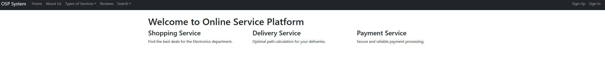
> Navigation bar, service highlights, login/register buttons.

### 2. Sign Up & Sign In
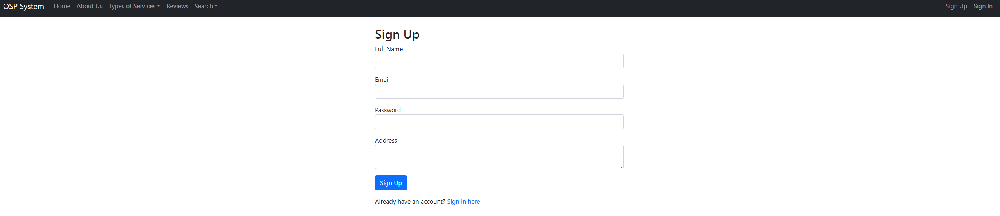
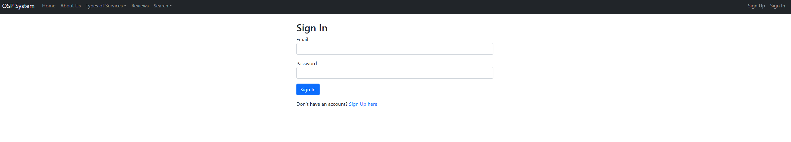
> Profile creation with email, name, address; password hashing.

### 3. Shopping – Electronics Department
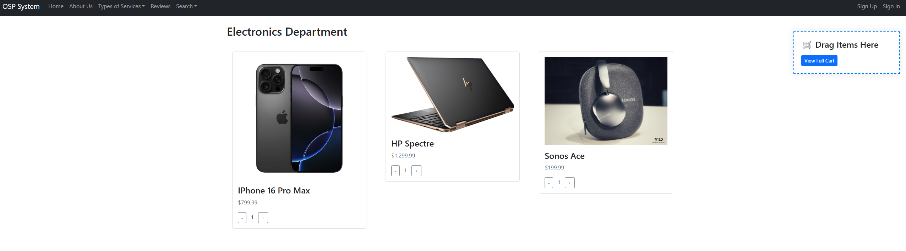
> Items displayed with quantity buttons. Drag any card into the floating cart preview.

### 4. Cart & Checkout
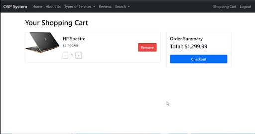
> Modify quantities, remove items, see total. Click “Checkout” to proceed to delivery.

### 5. Delivery Planning


> Choose a branch, view driving distance/time on map. Pick standard or express shipping, select date/time.

### 6. Payment & Invoice
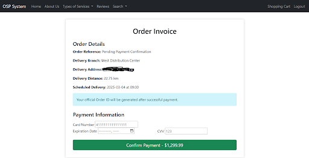
> Invoice summary, multiple payment methods, card/gift/cash fields dynamic.

### 7. Order Success/Failure & Truck Assignment
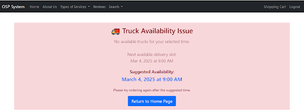
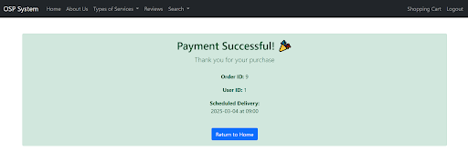
> Order ID, delivery date, truck assigned (background event). 

### 8. Review
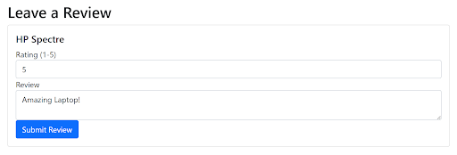
> Option to leave a review.

### 9. Admin – DB Maintain

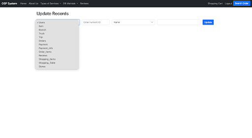
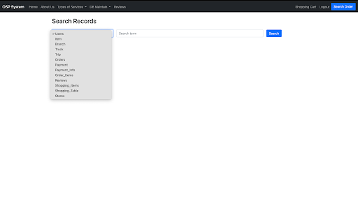
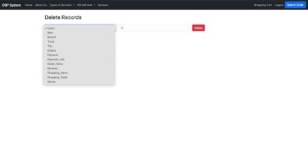
> Full CRUD interfaces for all tables, accessible only to admins.

### 10. Search Orders
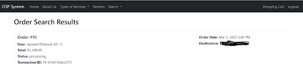
> From navbar, search by `UserID,OrderID` format. Results show order details.

---

## Installation & Setup (XAMPP)

### Prerequisites

- Windows / macOS / Linux
- [XAMPP](https://www.apachefriends.org/) (Apache + MySQL + PHP)

### Step-by-Step Guide

#### 1. Install XAMPP

Run the installer and keep the default settings:

- **Windows:** `C:\xampp`
- **macOS:** `/Applications/XAMPP`
- **Linux:** `/opt/lampp`

#### 2. Clone the Repository

Open a terminal (or Command Prompt) and navigate to the XAMPP `htdocs` folder:

```bash
# For Windows
cd C:\xampp\htdocs

# For macOS
cd /Applications/XAMPP/htdocs

# For Linux
cd /opt/lampp/htdocs
````

Clone the repository:

```bash
git clone https://github.com/your-username/osp-project.git
```

#### 3. Start XAMPP Services

1. Open the **XAMPP Control Panel**.
2. Click **Start** for **Apache**.
3. Click **Start** for **MySQL**.

#### 4. Create the Database

1. Open your browser and go to:
   `http://localhost/phpmyadmin`
2. Click **New** on the left sidebar.
3. Enter the database name:
   `osp_db`
4. Set the charset to:
   `utf8_general_ci`
5. Click **Create**.

#### 5. Import the Database Schema

1. In phpMyAdmin, select the `osp_db` database you just created.

2. Click the **Import** tab.

3. Click **Choose File** and select:

   ```text
   C:\xampp\htdocs\osp-project\sql\tables.sql
   ```

4. Click **Go** at the bottom.

This will create all tables and insert sample data, including items, branches, and trucks.

#### 6. Create the MySQL Event (Truck Availability)

To automatically update truck status after deliveries, you need to create a MySQL event.

Open your browser and go to:

`http://localhost/osp-project/scripts/truckevent.php`

You should see:

> Event 'ResetTruckAvailability' created successfully.

This script schedules an event that runs every hour to reset trucks to `available` after their delivery time has passed.

#### 7. Configure Database Connection

Navigate to:

```text
C:\xampp\htdocs\osp-project\config\
```

Open the existing `database.php` file.

Ensure the following credentials match your XAMPP setup:

```php
$host = 'localhost';
$user = 'root';
$password = ''; 
$database = 'osp_db';
```

If you changed the database name, username, or password during installation, update these values accordingly.

#### 8. Access the Application

Open your browser and navigate to:

`http://localhost/osp-project/public/index.php?route=home`

### Default Admin Account

To create an admin user:

1. Sign up as a regular user.
2. In phpMyAdmin, go to the **Users** table.
3. Find your account.
4. Change the `User_Type` column from `user` to `admin`.
